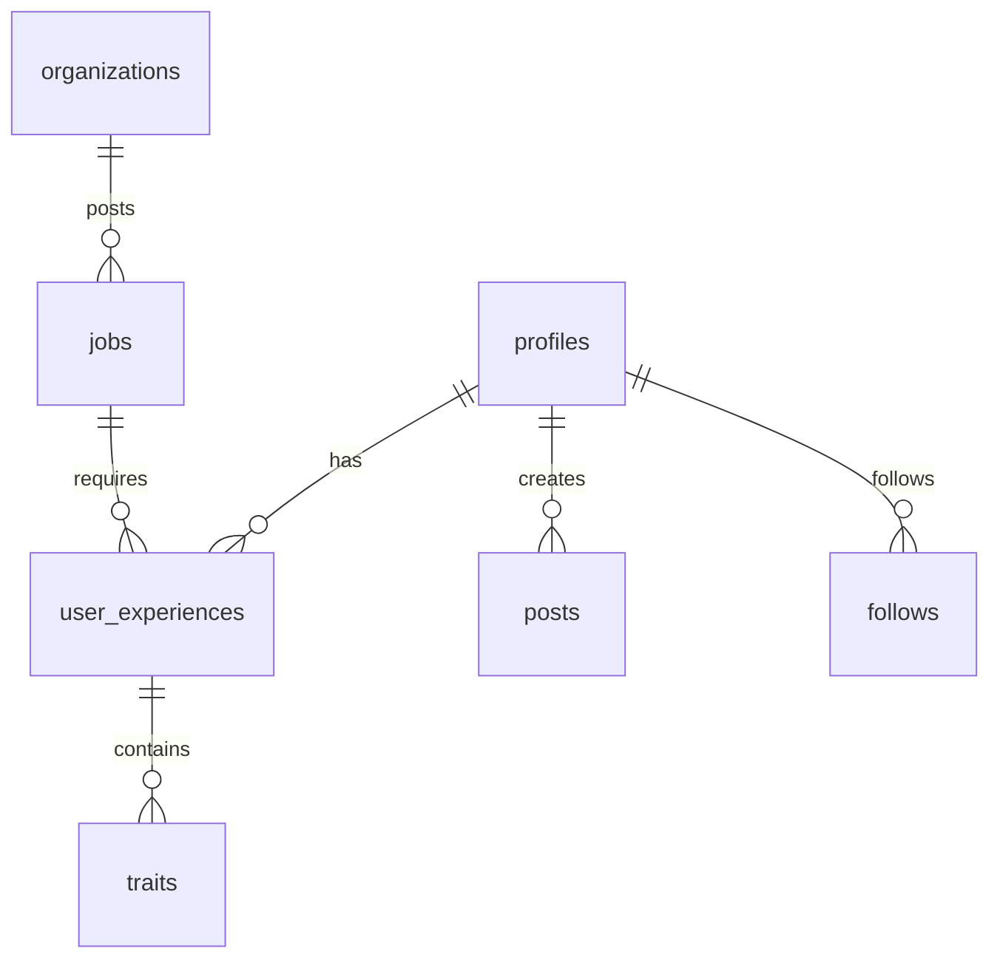
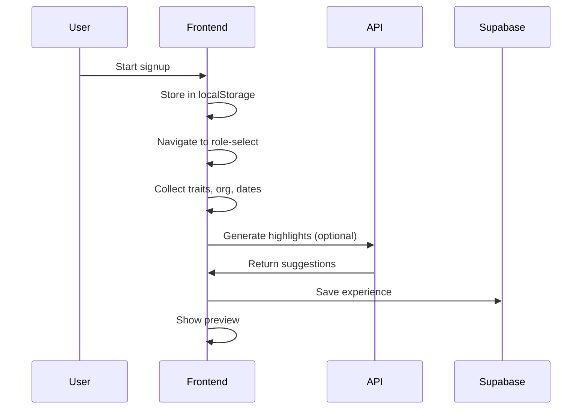
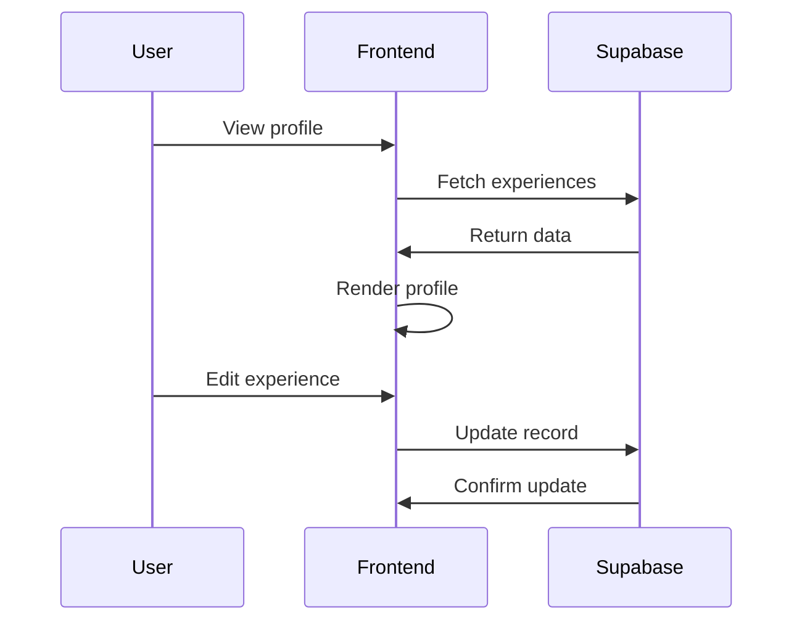
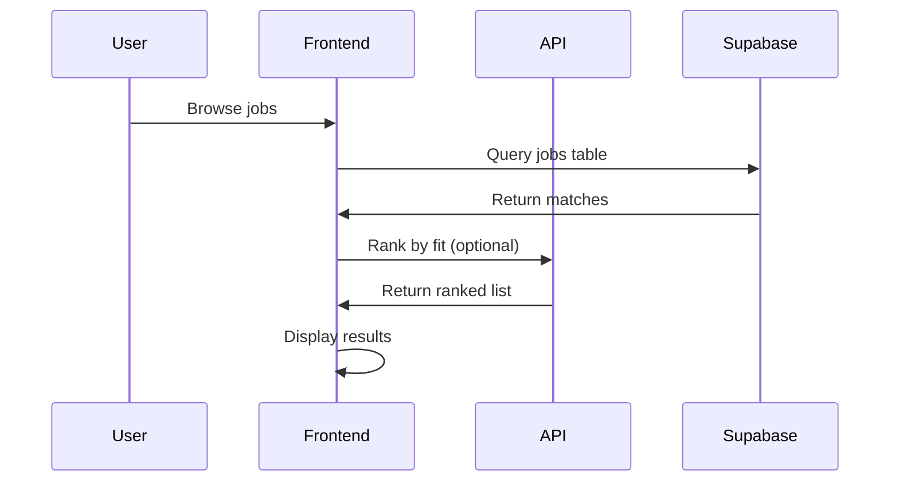
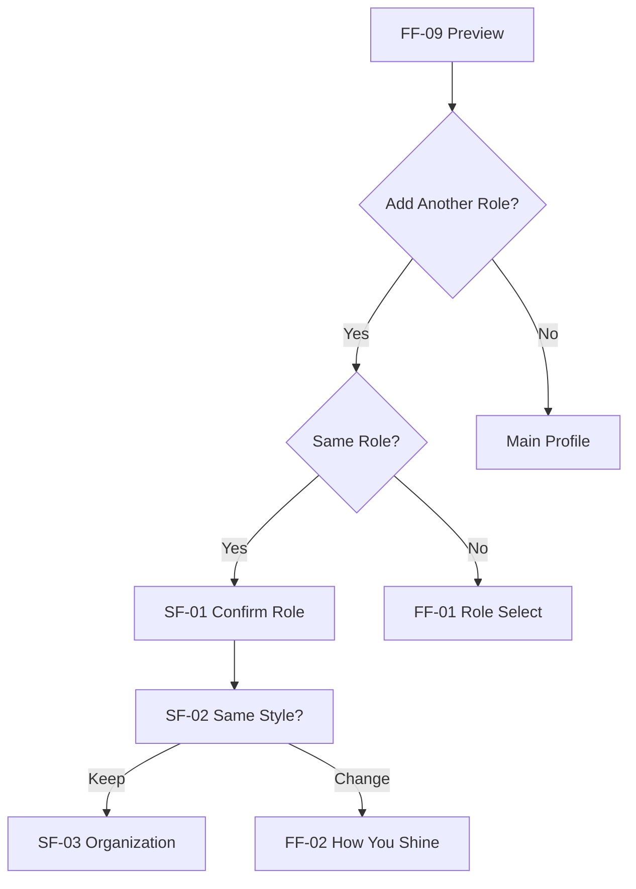

# Servinly - Hospitality Career Platform

**Next.js 14 + Supabase + Vercel + OpenAI (optional)**

Professional networking platform for hospitality workers. Worker-first approach to career building and job discovery.

## 🗂️ Folder Map

```
servinly-app/
├── src/
│   ├── app/                    # Next.js App Router
│   ├── components/             # React components
│   ├── config/                 # App configuration
│   ├── content/                # Copy & content data
│   ├── lib/                    # Utilities & hooks
│   ├── types/                  # TypeScript definitions
│   └── styles/                 # CSS & themes
├── supabase/                   # Database schema & migrations
├── docs/                       # Development documentation
└── .github/                    # GitHub workflows & config
```

## 🚀 Quickstart

### Development
```bash
git clone <repo>
npm install
cp .env.example .env.local
# Add your keys to .env.local
npm run dev
# http://localhost:3000
```

## 🔐 Dev Account (Local Development)

For secure local development with real authentication:

### Setup
1. **Create real Auth user in Supabase dashboard:**
   - Email: `dev@example.com`
   - Password: `dev-password`
   - Copy the user's UUID from Auth > Users

2. **Configure .env.local:**
   ```bash
   NEXT_PUBLIC_DEV_EMAIL=dev@example.com
   NEXT_PUBLIC_DEV_PASSWORD=dev-password
   NEXT_PUBLIC_DEV_FAKE_USER_ID=<COPIED_AUTH_UID>
   NEXT_PUBLIC_ONB_SUPABASE_SAVE=true
   ```

### How It Works
- **Auto sign-in**: `ensureDevSession()` automatically signs in during development
- **Real Auth user**: Uses actual Supabase Auth UID (not fake ID)
- **RLS compliant**: Row Level Security passes because user is authenticated
- **Production safe**: All dev flows disabled in production builds

### Security Features
- **Never bundled**: Dev credentials excluded from production builds
- **Real authentication**: Uses legitimate Supabase Auth session
- **RLS intact**: Database security policies remain enforced
- **Service key protection**: Server-only usage, never exposed to client

### Local Demo Bypass (Legacy)
For testing onboarding persistence without authentication:
```bash
# In .env.local, set a fake user ID:
NEXT_PUBLIC_DEV_FAKE_USER_ID=550e8400-e29b-41d4-a716-446655440000
NEXT_PUBLIC_ONB_SUPABASE_SAVE=true

# For dev service route (requires service role key):
SUPABASE_SERVICE_ROLE_KEY=your_service_role_key_here
```
This allows clicking through the onboarding flow and saving to Supabase without requiring signup/login. **Only works in development mode** (`NODE_ENV !== "production"`).

#### Dev Service Route
The system includes a dev-only API route (`/api/dev/finalize`) that uses Supabase service role authentication to bypass RLS policies during local development:

- **Route**: `POST /api/dev/finalize` 
- **Purpose**: Finalize roles without user session in development
- **Authentication**: Uses `SUPABASE_SERVICE_ROLE_KEY` (server-side only)
- **Production Guard**: Returns 404 in production (`NODE_ENV === 'production'`)
- **Security**: Service role key is never exposed to client-side code

**⚠️ NEVER enable this route in production environments.**

##### Dev Service Route Checklist
- Set `.env.local`:
  ```bash
  NEXT_PUBLIC_SUPABASE_URL=https://your-project.supabase.co
  SUPABASE_SERVICE_ROLE_KEY=your_service_role_key_here   # server only
  ```
- Never expose service role in `NEXT_PUBLIC_*` variables
- API returns `{ ok: false, error }` with HTTP 400/500 on validation/DB errors
- Uses Zod validation for strict payload checking
- Node.js runtime ensures safe `process.env` access

### Test Environment
- **URL**: `test.servinly.com`
- **Password**: `servinly.hobart-2024`
- **Purpose**: Feature testing & QA

### Production
- **URL**: `servinly.com`
- **Status**: Coming Soon (redirected)
- **Deploy**: Vercel dashboard

## 📚 Documentation

- **[Architecture](docs/ARCHITECTURE.md)** - System design & data flow
- **[Workflow](docs/WORKFLOW.md)** - Daily development process
- **[Onboarding V2](docs/ONBOARDING-V2.md)** - User flow specification

## 🧪 Staging Verification

### Onboarding V2 Final Row Creation
To verify that new final rows are created and immediately reflected in the profile:

1. **Enable Supabase persistence flag:**
   ```bash
   export NEXT_PUBLIC_ONB_SUPABASE_SAVE=true
   ```

2. **Complete onboarding flow:**
   - Navigate to `/profile` and click "Create Your First Role"
   - Complete all 9 onboarding steps through to Preview
   - Click "Finish Profile" - should navigate to `/profile`

3. **Verify database persistence:**
   ```sql
   -- Check user_roles table for new final row
   SELECT id, role_id, status, created_at 
   FROM public.user_roles 
   WHERE user_id = '<your-user-id>' 
   ORDER BY created_at DESC;
   ```

4. **Verify profile reflection:**
   - Profile page should show the new role immediately (no reload needed)
   - Multiple final rows should be sorted by `created_at DESC`
   - SWR revalidation ensures real-time updates

**Expected behavior:** Each completed onboarding creates a distinct final row with unique ID, immediately visible in profile.
- **[Environments](docs/ENVIRONMENTS.md)** - Dev/Test/Prod setup
- **[Recovery](docs/RECOVERY.md)** - Rollback procedures
- **[Cursor Prompts](docs/CURSOR-PROMPTS.md)** - AI assistant templates
- **[Next Steps](docs/NEXT-STEPS.md)** - Development roadmap

## 🎯 What to Work On Today

See **[docs/NEXT-STEPS.md](docs/NEXT-STEPS.md)** for current development priorities and actionable slices.

## 🔧 Key Commands

```bash
npm run dev          # Start development server
npm run build        # Build for production
npm run test         # Run test suite
npm run lint         # Lint code
npm run type:onboarding  # Type check onboarding flow
```

## 🗄️ Turning on Supabase Persistence (Staging Only)

By default, Onboarding V2 runs in **client-only mode** with localStorage persistence. To enable Supabase database persistence:

### Enable Feature Flag
```bash
# In .env.local
NEXT_PUBLIC_ONB_SUPABASE_SAVE=true
```

### Deploy Workflow
1. **ZIP-first**: Create deployment artifact with flag enabled
2. **Staging-first**: Deploy to test environment for validation
3. **Production**: Only after staging verification

### Important Notes
- **Default**: Flag is `false` in `.env.example` 
- **CI/Main**: Flag should remain `false` in version control
- **Client-only**: When disabled, all repo methods return success no-ops
- **No render impact**: Database calls only happen on user actions

## 🌟 Features

- **Multi-step onboarding** with role-specific flows
- **AI-powered content** (optional, with fallbacks)
- **Mobile-first design** with responsive layouts
- **Supabase backend** with real-time capabilities
- **Vercel deployment** with environment isolation
```

## 2. docs/ARCHITECTURE.md

```markdown:docs/ARCHITECTURE.md
# Architecture Overview

**At a glance**: Layered architecture with clear separation between contracts, configuration, content, and UI.

## ️ App Layers

```
┌─────────────────────────────────────┐
│              UI Layer               │
│  src/app/ + src/components/        │
├─────────────────────────────────────┤
│           Content Layer             │
│        src/content/                 │
├─────────────────────────────────────┤
│         Config Layer                │
│       src/config/                   │
├─────────────────────────────────────┤
│        Contracts Layer              │
│        src/types/                   │
├─────────────────────────────────────┤
│         Server Layer                │
│      src/app/api/ + supabase/      │
└─────────────────────────────────────┘
```

### Layer Responsibilities

- **UI**: React components, layouts, pages
- **Content**: Copy, suggestions, role-specific data
- **Config**: Flow definitions, routing logic
- **Contracts**: Type definitions, Zod schemas
- **Server**: API routes, database operations

## 📊 Data Model

### Core Tables

```sql
profiles (id, email, first_name, last_name, user_type, ...)
user_experiences (id, user_id, role, org_name, traits[], ...)
traits (id, name, category, description)
posts (id, user_id, content, type, ...)
follows (follower_id, following_id)
jobs (id, title, org_id, requirements, ...)
organizations (id, name, type, location, ...)
```

### Key Relationships



## 🔄 Request Flow Diagrams

### Onboarding Flow



### Profile Management



### Job Discovery



## 🤖 AI Integration

### Optional AI Features

- **Behind environment key**: `OPENAI_API_KEY`
- **Deterministic fallbacks**: Always functional without AI
- **Caching strategy**: Reduce API calls
- **Progressive enhancement**: AI improves, doesn't break

### AI Endpoints

```
/api/highlights          # Career suggestions
/api/highlights/bulletize # Text → bullets
/api/highlights/polish   # Content enhancement
/api/responsibilities/polish # Role descriptions
```

### Fallback Behavior

```typescript
// AI unavailable → use deterministic methods
if (!process.env.OPENAI_API_KEY) {
  return fallbackSuggestions();
}
```

## 🔒 Security & Access

- **Row Level Security (RLS)**: User data isolation
- **Environment isolation**: Separate domains per environment
- **Middleware protection**: Route-level access control
- **API rate limiting**: Prevent abuse

## 📱 Frontend Architecture

- **Next.js 14**: App Router, Server Components
- **Mobile-first**: Responsive design patterns
- **State management**: Zustand + React hooks
- **Styling**: Tailwind CSS + CSS custom properties
```

## 3. docs/WORKFLOW.md

```markdown:docs/WORKFLOW.md
# Development Workflow

**At a glance**: Daily loop with clear modes, savepoints, and guardrails.

## 🔄 Daily Loop

```
Goal → Mode (ASK/AGENT) → Savepoint → Build → CI → PR
```

### 1. **Goal Setting**
- Define what you're building today
- Check [NEXT-STEPS.md](NEXT-STEPS.md) for priorities
- Scope to one feature/component

### 2. **Mode Selection**
- **ASK Mode**: Explore, understand, plan
- **AGENT Mode**: Build, implement, test

### 3. **Savepoint Tag**
```bash
git add .
git commit -m "feat: [feature-name] - savepoint before [change]"
git tag savepoint-[feature-name]-$(date +%Y%m%d-%H%M)
git push --tags
```

### 4. **Build & Test**
```bash
npm run type:onboarding  # Type check
npm run lint             # Lint code
npm run test             # Unit tests
npm run build            # Build check
```

### 5. **CI Validation**
- Automated type checking
- Linting rules
- Unit test coverage
- 2-3 Playwright happy paths

### 6. **Pull Request**
- **App PRs**: Frontend, components, pages
- **Infra PRs**: Database, API, deployment
- **No cross-scope**: Keep changes focused

## 🚩 Feature Flags Policy

### Flag Naming
```bash
NEXT_PUBLIC_FEATURE_[FEATURE_NAME]=true
```

### Flag Usage
```typescript
if (process.env.NEXT_PUBLIC_FEATURE_AI_ASSIST === 'true') {
  // AI features enabled
} else {
  // Fallback behavior
}
```

### Flag Management
- **Development**: Enable all flags
- **Test**: Selective flag testing
- **Production**: Gradual rollout

## 🔀 App vs Infra Separation

### App Scope
- React components
- Page layouts
- User interactions
- State management

### Infra Scope
- Database schema
- API endpoints
- Authentication
- Deployment config

### Cross-Scope Rules
- **Default**: No cross-scope changes
- **Exception**: RFC required for cross-scope features
- **Review**: Tech lead approval for exceptions

## 🎯 Mode Prompts

### Explore Mode (ASK)
```
I'm exploring the codebase to understand [feature]. 
Show me the relevant files and explain how they work together.
Focus on understanding, not making changes.
```

### Build Mode (AGENT)
```
I'm building [feature] and need to modify these specific files:
- src/app/[path]/page.tsx
- src/components/[component].tsx
- src/lib/[utility].ts

Don't modify contracts/config/content unless explicitly requested.
```

## ✅ Definition of Done

### For Each Feature
- [ ] TypeScript compilation passes
- [ ] Linting rules satisfied
- [ ] Unit tests written and passing
- [ ] Feature flag implemented
- [ ] Fallback behavior tested
- [ ] Mobile responsiveness verified
- [ ] Documentation updated

### For Each PR
- [ ] Single scope (app OR infra)
- [ ] Feature flag enabled
- [ ] CI pipeline passes
- [ ] Code review completed
- [ ] Savepoint tag created

## 🚨 Guardrails

### Never
- Modify contracts without RFC
- Cross app/infra boundaries in one PR
- Deploy without feature flags
- Skip savepoint tags

### Always
- Test fallback behavior
- Verify mobile experience
- Update relevant docs
- Create savepoint before major changes

## 🔧 Quick Commands

```bash
# Create savepoint
git tag savepoint-[name]-$(date +%Y%m%d-%H%M)

# Check feature flags
grep -r "NEXT_PUBLIC_FEATURE" src/

# Run full CI locally
npm run type:onboarding && npm run lint && npm run test && npm run build

# Reset to savepoint
git reset --hard savepoint-[name]-[timestamp]
```
```

## 4. docs/ONBOARDING-V2.md

```markdown:docs/ONBOARDING-V2.md
# Onboarding V2 Specification

**At a glance**: Dual-flow system with role-specific content and optional AI enhancement.

##  Flow Overview

### Full Flow (FF-01 → FF-09)
**Use case**: First role or different role family

| Step | ID | Path | Purpose | Content Source |
|------|----|------|---------|----------------|
| 1 | FF-01 | `/role-select` | Role selection | Role options + signup data |
| 2 | FF-02 | `/how-you-shine` | Personality traits | Role-specific trait options |
| 3 | FF-03 | `/busy-shift` | Work scenarios | Role-specific scenarios |
| 4 | FF-04 | `/vibe` | Work environment | Role-specific vibe options |
| 5 | FF-05 | `/organization` | Company details | User input |
| 6 | FF-06 | `/dates` | Employment timeline | User input |
| 7 | FF-07 | `/career-highlight` | Key achievements | Role-specific suggestions |
| 8 | FF-08 | `/responsibilities` | Job duties | Role-specific options |
| 9 | FF-09 | `/preview` | Profile review | All collected data |

### Short Flow (SF-01 → SF-07)
**Use case**: Same role, different organization

| Step | ID | Path | Purpose | Content Source |
|------|----|------|---------|----------------|
| 1 | SF-01 | `/confirm-role` | Role confirmation | Previous role data |
| 2 | SF-02 | `/same-style` | Style consistency | Previous traits/vibe |
| 3 | SF-03 | `/organization` | Company details | User input |
| 4 | SF-04 | `/dates` | Employment timeline | User input |
| 5 | SF-05 | `/career-highlight` | Key achievements | Previous + new suggestions |
| 6 | SF-06 | `/responsibilities` | Job duties | Previous + new options |
| 7 | SF-07 | `/preview` | Profile review | All collected data |

## 🧭 Router & Guards

### Navigation Rules
```typescript
// Next step resolution
function getNextStep(currentStep: StepId): StepId | null {
  if (currentStep.group === 'full') {
    return NEXT_FULL[currentStep.id];
  }
  if (currentStep.group === 'short') {
    return NEXT_SHORT[currentStep.id];
  }
  return null;
}
```

### Preview Actions

The Preview step includes an optional "Add Another Role" button controlled by the `NEXT_PUBLIC_FEATURE_ONB_ADD_ANOTHER` environment flag:

- **Default**: `false` (button hidden)
- **When enabled**: Shows button that navigates to Role Select for multi-role workflows
- **Purpose**: Allows users to add additional roles without losing current progress

### Branching Logic


### Guard Conditions
```typescript
// Example guard for dates step
const LEAVE_GUARDS = {
  "FF-06": (ctx: FlowContext) => Boolean(ctx.hasDates),
  "SF-04": (ctx: FlowContext) => Boolean(ctx.hasDates),
};
```

##  Content Principles

### Deterministic First-Paint
- **No generic defaults**: Every suggestion is role-specific
- **Content pre-loaded**: No API calls blocking initial render
- **Fallback content**: Always something to show

### Content Sources
```typescript
// Role-specific content mapping
const CONTENT_BY_ROLE = {
  bartender: {
    traits: ["creative", "detail-oriented", "customer-focused"],
    scenarios: ["calm-organized", "efficiency-mode"],
    responsibilities: ["cocktail-creation", "bar-management"]
  },
  server: {
    traits: ["people-person", "problem-solver"],
    scenarios: ["rally-team", "keep-informed"],
    responsibilities: ["guest-service", "coordination"]
  }
};
```

## 🤖 AI Integration

### Optional AI Endpoints
- **When to call**: Only for enhancement, not initial content
- **Caching strategy**: Cache AI responses to reduce API calls
- **Fallback behavior**: Deterministic content always available

### AI Usage Pattern
```typescript
// 1. Show deterministic content immediately
const suggestions = getRoleSuggestions(role);

// 2. Optionally enhance with AI (non-blocking)
if (aiEnabled && userRequestsEnhancement) {
  const enhanced = await enhanceWithAI(suggestions);
  updateContent(enhanced);
}
```

### AI Endpoints
```
POST /api/highlights/polish
- Input: Selected responsibilities
- Output: Enhanced descriptions
- Cache: 24 hours

POST /api/highlights/bulletize
- Input: User text
- Output: Resume bullets
- Cache: Not cached (user-specific)
```

## 📋 Contracts & Types

### Core Types
```typescript
interface OnboardingState {
  role: string;
  traits: TraitId[];
  scenario: ScenarioId;
  vibe: VibeId;
  organization: string;
  dates: DateRange;
  highlights: string[];
  responsibilities: ResponsibilityId[];
}

interface FlowContext {
  hasRole?: boolean;
  hasTraits?: boolean;
  hasDates?: boolean;
  isComplete?: boolean;
}
```

### Validation Schemas
```typescript
const OnboardingSchema = z.object({
  role: z.string().min(1),
  traits: z.array(z.string()).min(1).max(3),
  scenario: z.string().optional(),
  vibe: z.string().optional(),
  organization: z.string().min(1),
  dates: DateRangeSchema,
  highlights: z.array(z.string()).min(1),
  responsibilities: z.array(z.string()).min(1)
});
```

## 🎯 Implementation Status

### ✅ Complete
- [x] Flow definition (FF-01 → FF-09, SF-01 → SF-07)
- [x] Router logic (next/prev navigation)
- [x] Basic step pages (scaffold)
- [x] Content structure (role-specific)

### 🚧 In Progress
- [ ] Content population (deterministic)
- [ ] AI integration (optional enhancement)
- [ ] Validation guards
- [ ] Short flow branching

### 📋 Next Steps
- [ ] Populate role-specific content
- [ ] Implement branching logic
- [ ] Add validation guards
- [ ] Test both flows end-to-end

## 🔧 Development Commands

```bash
# Type check onboarding flow
npm run type:onboarding

# Test specific step
npm run test -- --testNamePattern="role-select"

# Build onboarding flow
npm run build
```
```

## 5. docs/ENVIRONMENTS.md

```markdown:docs/ENVIRONMENTS.md
# Environment Configuration

**At a glance**: Three-tier environment setup with domain isolation and middleware protection.

## 🌐 Environment Overview

| Environment | Domain | Purpose | Access | Status |
|-------------|--------|---------|---------|---------|
| **Development** | `localhost:3000` | Local development | Open | ✅ Active |
| **Test** | `test.servinly.com` | Feature testing | Password-gated | ✅ Active |
| **Production** | `servinly.com` | Public site | Coming Soon | 🚧 Redirected |

## 🔐 Access Control

### Development
- **No restrictions**: Full access to all features
- **Hot reload**: Instant feedback on changes
- **Debug tools**: Full console access

### Test Environment
- **Password**: `servinly.hobart-2024`
- **Access point**: `/test-gate`
- **Session**: Cookie-based (`testAccess=granted`)
- **Duration**: 24 hours

### Production
- **Status**: Coming Soon page only
- **Middleware**: Blocks all routes except `/coming-soon`
- **Purpose**: Public landing page

##  Middleware Rules

### Production Rules
```typescript
// servinly.com, www.servinly.com
if (hostname === 'servinly.com' || hostname === 'www.servinly.com') {
  // Only allow coming-soon and essential assets
  if (pathname === '/coming-soon' || pathname.startsWith('/_next') || pathname.startsWith('/api')) {
    return NextResponse.next();
  }
  // Redirect ALL other paths to coming-soon
  return NextResponse.redirect(new URL('/coming-soon', request.url));
}
```

### Test Environment Rules
```typescript
// test.servinly.com
if (hostname === 'test.servinly.com') {
  // Check test access cookie
  const testAccess = request.cookies.get('testAccess')?.value;
  if (!testAccess || testAccess !== 'granted') {
    return NextResponse.redirect(new URL('/test-gate', request.url));
  }
}
```

### Development Rules
```typescript
// localhost:3000
// No restrictions, full access
```

## ️ Supabase Projects

### Project Structure
```
servinly-staging    # Test environment database
├── URL: https://[id].supabase.co
├── Database: PostgreSQL 15
├── Auth: Supabase Auth
└── Storage: File storage

servinly-production # Production database
├── URL: https://[id].supabase.co
├── Database: PostgreSQL 15
├── Auth: Supabase Auth
└── Storage: File storage
```

### Environment Variables
```bash
# Development
NEXT_PUBLIC_SUPABASE_URL=http://localhost:54321
NEXT_PUBLIC_SUPABASE_ANON_KEY=eyJ...

# Test
NEXT_PUBLIC_SUPABASE_URL=https://[staging-id].supabase.co
NEXT_PUBLIC_SUPABASE_ANON_KEY=eyJ...

# Production
NEXT_PUBLIC_SUPABASE_URL=https://[production-id].supabase.co
NEXT_PUBLIC_SUPABASE_ANON_KEY=eyJ...
```

### Row Level Security (RLS)
- **Enabled on all tables**: User data isolation
- **Policies**: Users can only access their own data
- **Testing**: RLS policies tested in staging

## 🚀 Vercel Deployment

### Project Mapping
```
servinly-staging    → test.servinly.com
servinly-production → servinly.com
```

### Deployment Settings
```json
{
  "framework": "nextjs",
  "buildCommand": "npm run build",
  "outputDirectory": ".next",
  "installCommand": "npm install",
  "devCommand": "npm run dev"
}
```

### Environment Variables
```bash
# Staging
NEXT_PUBLIC_SUPABASE_URL=https://[staging-id].supabase.co
NEXT_PUBLIC_SUPABASE_ANON_KEY=eyJ...
OPENAI_API_KEY=sk-...

# Production
NEXT_PUBLIC_SUPABASE_URL=https://[production-id].supabase.co
NEXT_PUBLIC_SUPABASE_ANON_KEY=eyJ...
OPENAI_API_KEY=sk-...
```

## 📋 Deployment Checklist

### Staging Deployment
- [ ] Feature flags enabled
- [ ] Environment variables set
- [ ] Database migrations applied
- [ ] Smoke tests passing
- [ ] Performance metrics acceptable

### Production Deployment
- [ ] Staging validation complete
- [ ] Feature flags configured
- [ ] Environment variables verified
- [ ] Database backup created
- [ ] Rollback plan ready

### Smoke Tests
```bash
# Test environment health
curl -f https://test.servinly.com/api/health

# Check feature flags
curl -f https://test.servinly.com/api/features

# Verify database connection
curl -f https://test.servinly.com/api/db-status
```

##  Environment Sync

### Database Migrations
```bash
# Apply to staging first
supabase db push --project-ref [staging-ref]

# Test in staging
# Apply to production
supabase db push --project-ref [production-ref]
```

### Environment Variables
```bash
# Sync staging to production
vercel env pull .env.staging
vercel env push .env.production
```

### Content Updates
- **Development**: Local content changes
- **Test**: Content validation
- **Production**: Content deployment

## 🚨 Troubleshooting

### Common Issues
1. **Test access expired**: Clear cookies, re-enter password
2. **Database connection**: Check environment variables
3. **Feature flags**: Verify NEXT_PUBLIC_ variables
4. **Middleware blocking**: Check hostname configuration

### Recovery Steps
1. **Verify environment**: Check current hostname
2. **Check cookies**: Clear and re-authenticate
3. **Validate config**: Confirm environment variables
4. **Check logs**: Vercel function logs

## 🔧 Quick Commands

```bash
# Check current environment
curl -s https://[domain]/api/environment

# Test database connection
curl -s https://[domain]/api/db-status

# Verify feature flags
curl -s https://[domain]/api/features

# Clear test access
# Delete cookie: testAccess=granted
```
```

## 6. docs/RECOVERY.md

```markdown:docs/RECOVERY.md
# Recovery Kit

**At a glance**: 30-minute rollback guide for common failure scenarios.

##  Emergency Recovery

### Create Savepoint Tag
```bash
# Before making changes
git add .
git commit -m "feat: [feature-name] - emergency savepoint"
git tag emergency-[feature-name]-$(date +%Y%m%d-%H%M)
git push --tags
```

### Restore Last Good Build
```bash
# List available savepoints
git tag --list "savepoint-*" --sort=-version:refname

# Reset to specific savepoint
git reset --hard savepoint-[name]-[timestamp]

# Force push to remote (if necessary)
git push --force-with-lease origin main
```

## 🔄 Rollback Procedures

### 1. Code Rollback
```bash
# Quick rollback to last working commit
git log --oneline -10
git reset --hard [commit-hash]

# Rollback specific file
git checkout [commit-hash] -- src/app/[file].tsx

# Rollback entire feature branch
git reset --hard origin/main
```

### 2. Database Rollback
```bash
# Restore from backup
supabase db reset --project-ref [project-ref]

# Rollback specific migration
supabase migration down --project-ref [project-ref]

# Restore from dump
psql [connection-string] < backup.sql
```

### 3. Environment Rollback
```bash
# Revert environment variables
vercel env pull .env.backup
vercel env push

# Disable feature flags
vercel env rm NEXT_PUBLIC_FEATURE_[NAME]

# Rollback deployment
vercel rollback [deployment-id]
```

## 🚩 Feature Flag Recovery

### Disable Problematic Features
```bash
# Remove feature flag
vercel env rm NEXT_PUBLIC_FEATURE_AI_ASSIST

# Redeploy without feature
vercel --prod

# Verify flag is disabled
curl -s https://[domain]/api/features
```

### Re-enable Features
```bash
# Add feature flag back
vercel env add NEXT_PUBLIC_FEATURE_AI_ASSIST

# Set value
vercel env add NEXT_PUBLIC_FEATURE_AI_ASSIST true

# Redeploy
vercel --prod
```

## 🤖 AI Endpoint Recovery

### Check AI Status
```bash
# Test OpenAI connection
curl -s https://[domain]/api/highlights | jq '.hasApiKey'

# Check API key validity
curl -s https://[domain]/api/highlights | jq '.apiKeyLength'
```

### Restore AI Functionality
```bash
# Update API key
vercel env add OPENAI_API_KEY [new-key]

# Verify key works
curl -s https://[domain]/api/highlights | jq '.hasApiKey'

# Test AI endpoint
curl -X POST https://[domain]/api/highlights/bulletize \
  -H "Content-Type: application/json" \
  -d '{"text":"test","role":"bartender"}'
```

### Fallback Verification
```bash
# Test without AI key
vercel env rm OPENAI_API_KEY
vercel --prod

# Verify fallback works
curl -s https://[domain]/api/highlights | jq '.suggestions'
```

## 📞 Who to Ping

### Escalation Path
1. **Developer**: Self (immediate action)
2. **Tech Lead**: @tech-lead (30 minutes)
3. **DevOps**: @devops (1 hour)
4. **Product**: @product (2 hours)

### Contact Information
- **Tech Lead**: [tech-lead@servinly.com]
- **DevOps**: [devops@servinly.com]
- **Emergency**: [emergency@servinly.com]

## 🚨 Common Failure Modes

### 1. Build Failures
```bash
# Symptoms
npm run build fails
TypeScript errors
Linting failures

# Recovery
git reset --hard savepoint-[name]-[timestamp]
npm install
npm run build
```

### 2. Runtime Errors
```bash
# Symptoms
500 errors in production
Database connection failures
API timeouts

# Recovery
check environment variables
verify database status
rollback to last working deployment
```

### 3. Feature Flag Issues
```bash
# Symptoms
Features not working
Inconsistent behavior
Environment variable conflicts

# Recovery
disable problematic flags
redeploy without flags
verify flag configuration
```

### 4. AI Service Failures
```bash
# Symptoms

## Dev auth seeding
```bash
# 1) Put real Supabase creds in .env.local (URL, anon key, SERVICE_ROLE)
# 2) Set these too:
NEXT_PUBLIC_DEV_EMAIL=claudiolopesjr@hotmail.com
NEXT_PUBLIC_DEV_PASSWORD=dev-password

# 3) Install dev deps (ts-node) if missing:
npm i -D ts-node typescript

# 4) Seed the user
npm run dev:seed-auth
```
AI endpoints returning errors
OpenAI API failures
Fallback not working

# Recovery
check API key validity
verify fallback logic
disable AI features temporarily
```

## 🔧 Recovery Tools

### Health Check Scripts
```bash
#!/bin/bash
# health-check.sh
DOMAIN=$1
echo "Checking $DOMAIN..."

# Basic health
curl -f "$DOMAIN/api/health" || echo "Health check failed"

# Database status
curl -f "$DOMAIN/api/db-status" || echo "Database check failed"

# Feature flags
curl -f "$DOMAIN/api/features" || echo "Features check failed"
```

### Rollback Scripts
```bash
#!/bin/bash
# rollback.sh
SAVEPOINT=$1
echo "Rolling back to $SAVEPOINT..."

git reset --hard $SAVEPOINT
git push --force-with-lease origin main
vercel --prod

echo "Rollback complete"
```

## ✅ Recovery Checklist

### Before Changes
- [ ] Create savepoint tag
- [ ] Verify rollback path
- [ ] Test in staging first
- [ ] Have backup plan

### During Recovery
- [ ] Assess impact scope
- [ ] Choose recovery method
- [ ] Execute rollback
- [ ] Verify recovery success

### After Recovery
- [ ] Document incident
- [ ] Update procedures
- [ ] Create new savepoint
- [ ] Plan prevention measures

## 🚀 Quick Recovery Commands

```bash
# Emergency savepoint
git tag emergency-[name]-$(date +%Y%m%d-%H%M)

# Quick rollback
git reset --hard savepoint-[name]-[timestamp]

# Disable feature
vercel env rm NEXT_PUBLIC_FEATURE_[NAME]

# Redeploy
vercel --prod

# Verify recovery
curl -f https://[domain]/api/health
```
```

## 7. docs/CURSOR-PROMPTS.md

```markdown:docs/CURSOR-PROMPTS.md
# Cursor Prompts

**At a glance**: Copy-ready prompts for ASK/AGENT modes with clear scope boundaries.

## 🎯 Mode Selection

### ASK Mode (Explore)
Use when you need to understand the codebase, explore options, or plan implementation.

### AGENT Mode (Build)
Use when you're ready to implement, modify, or build features.

##  ASK Mode Prompts

### General Exploration
```
I'm exploring the codebase to understand [specific feature/component].
Show me the relevant files and explain how they work together.
Focus on understanding the current implementation, not making changes.
```

### Architecture Understanding
```
I need to understand the architecture for [feature area].
Show me the contracts, config, content, and UI layers involved.
Explain the data flow and component relationships.
```

### Feature Planning
```
I'm planning to implement [feature].
Show me the existing patterns and components I should follow.
What are the key considerations and potential challenges?
```

### Debugging Help
```
I'm debugging an issue with [specific problem].
Show me the relevant code paths and help me understand what might be going wrong.
Don't make changes, just help me understand the issue.
```

## 🛠️ AGENT Mode Prompts

### Feature Implementation
```
I'm implementing [feature] and need to modify these specific files:
- src/app/[path]/page.tsx
- src/components/[component].tsx
- src/lib/[utility].ts

Follow the established patterns and don't modify contracts/config/content unless explicitly requested.
```

### Component Development
```
I'm building a new component for [purpose].
Create/modify these files following the established patterns:
- src/components/[component].tsx
- src/components/[component].test.tsx (if needed)

Use the existing design system and component patterns.
```

### Bug Fixes
```
I'm fixing a bug in [specific area].
Modify only the necessary files to resolve the issue:
- [list specific files]

Keep changes minimal and focused on the bug fix.
```

### Refactoring
```
I'm refactoring [component/feature] to improve [specific aspect].
Modify these files to implement the improvements:
- [list specific files]

Maintain the same functionality while improving the code structure.
```

##  Scope Boundaries

### App Scope (Safe to Modify)
- React components (`src/components/`)
- Page layouts (`src/app/`)
- Hooks and utilities (`src/lib/`)
- Styles and themes (`src/styles/`)

### Infra Scope (Requires Review)
- Database schema (`supabase/`)
- API endpoints (`src/app/api/`)
- Authentication logic
- Deployment config

### Protected Scope (RFC Required)
- Contracts (`src/types/`)
- Configuration (`src/config/`)
- Content data (`src/content/`)
- Core routing logic

##  Prompt Templates

### For New Features
```
I'm building [feature name] as part of [slice number] from NEXT-STEPS.md.

Scope: [app/infra]
Files to modify: [list specific files]
Feature flag: NEXT_PUBLIC_FEATURE_[NAME]

Requirements:
- [requirement 1]
- [requirement 2]
- [requirement 3]

Don't modify contracts/config/content unless explicitly requested.
```

### For Bug Fixes
```
I'm fixing a bug where [describe the issue].

Affected files: [list specific files]
Root cause: [if known]
Solution approach: [brief description]

Keep changes minimal and focused on the bug fix.
```

### For Refactoring
```
I'm refactoring [component/feature] to improve [specific aspect].

Current implementation: [brief description]
Desired improvement: [specific goal]
Files to modify: [list specific files]

Maintain existing functionality while improving [aspect].
```

## 🔒 Security & Best Practices

### Always Include
- Clear scope boundaries
- Specific file lists
- Feature flag requirements
- Don't modify instructions

### Never Include
- Vague file references
- Cross-scope changes
- Contract modifications without RFC
- Unclear requirements

## 📚 Example Prompts

### ASK Mode Example
```
I'm exploring the onboarding flow to understand how role selection works.
Show me the relevant files and explain the flow from role selection to the next step.
Focus on understanding the current implementation, not making changes.
```

### AGENT Mode Example
```
I'm implementing the AI assist feature for career highlights as part of slice 5 from NEXT-STEPS.md.

Scope: app
Files to modify:
- src/components/onboarding/CareerHighlightInput.tsx
- src/lib/useBulletize.ts
- src/app/api/highlights/bulletize/route.ts

Feature flag: NEXT_PUBLIC_FEATURE_AI_ASSIST

Requirements:
- Add AI assist button to career highlight input
- Integrate with bulletize API
- Show loading states and error handling
- Maintain fallback behavior when AI is unavailable

Don't modify contracts/config/content unless explicitly requested.
```

## 🎯 Prompt Best Practices

### Before Using AGENT Mode
1. **Understand the scope**: Know what you're building
2. **Identify files**: List specific files to modify
3. **Set boundaries**: Clearly state what not to modify
4. **Define requirements**: Be specific about what you need

### When Using ASK Mode
1. **Be specific**: Focus on particular areas
2. **Ask for understanding**: Request explanations, not changes
3. **Explore patterns**: Look for existing implementations
4. **Plan ahead**: Use this to prepare for AGENT mode

### Always Remember
- **Scope boundaries**: Respect app vs infra separation
- **Feature flags**: Include when implementing features
- **Contracts**: Don't modify without explicit request
- **Patterns**: Follow existing code patterns
```

## 8. docs/NEXT-STEPS.md

```markdown:docs/NEXT-STEPS.md
# Next Steps - Development Roadmap

**At a glance**: Incremental development plan with actionable slices, each = one PR.

## 🎯 Development Philosophy

- **Incremental**: Each slice is a complete, testable feature
- **Flagged**: All features behind feature flags
- **Fallback**: Deterministic behavior always available
- **Testable**: Each slice has clear acceptance criteria

## 📋 Slice Overview

| Slice | Priority | Scope | Status | Est. Time |
|-------|----------|-------|---------|-----------|
| 1 | 🔴 High | Rails |  Planned | 2-3 days |
| 2 | 🔴 High | Content |  Planned | 1-2 days |
| 3 | 🟡 Medium | SSR |  Planned | 2-3 days |
| 4 | 🟡 Medium | Personalization |  Planned | 2-3 days |
| 5 |  Medium | AI Assist |  Planned | 1-2 days |
| 6 | 🟢 Low | Polish |  Planned | 1 day |
| 7 |  Low | Short Flow |  Planned | 2-3 days |
| 8 | 🟢 Low | Persistence |  Planned | 1-2 days |

## 🚂 Slice 1: Rails Foundation

### Scope
Contracts, configuration, and routing foundation for onboarding v2.

### Feature Flag
```bash
NEXT_PUBLIC_FEATURE_ONBOARDING_V2_RAILS=true
```

### Acceptance Criteria
- [ ] Zod schemas for all onboarding data
- [ ] Flow configuration with step definitions
- [ ] Router logic for next/prev navigation
- [ ] Type-safe step transitions
- [ ] Unit tests for all contracts

### Files Touched
```
src/types/onboarding.ts
src/config/onboarding.flow.ts
src/lib/onboardingRouter.ts
src/lib/useStepRouter.ts
src/__tests__/contracts.test.ts
```

### Definition of Done
- [ ] All TypeScript compilation passes
- [ ] Unit tests cover all contracts
- [ ] Feature flag controls access
- [ ] No breaking changes to existing code

## 🎨 Slice 2: Role-Aware Content

### Scope
Populate role-specific content for all onboarding steps.

### Feature Flag
```bash
NEXT_PUBLIC_FEATURE_ROLE_CONTENT=true
```

### Acceptance Criteria
- [ ] Role-specific trait options
- [ ] Role-specific scenario descriptions
- [ ] Role-specific vibe options
- [ ] Role-specific responsibility groups
- [ ] Content for all supported roles

### Files Touched
```
src/content/onboarding.ts
src/content/responsibilities.ts
src/content/howYouShine.ts
src/content/busyShiftMoment.ts
src/content/yourVibeAtWork.ts
```

### Definition of Done
- [ ] All roles have complete content
- [ ] Content is role-specific (no generic defaults)
- [ ] Content loads without API calls
- [ ] TypeScript types match content structure

## ⚡ Slice 3: Responsibilities Ranker

### Scope
Server-side ranking of responsibilities based on user traits and role.

### Feature Flag
```bash
NEXT_PUBLIC_FEATURE_RESPONSIBILITY_RANKING=true
```

### Acceptance Criteria
- [ ] SSR ranking algorithm
- [ ] Trait-based scoring
- [ ] Role-specific weighting
- [ ] No generic defaults
- [ ] Performance under 100ms

### Files Touched
```
src/app/api/responsibilities/rank/route.ts
src/lib/responsibilityRanker.ts
src/server/rank.ts
src/__tests__/ranking.test.ts
```

### Definition of Done
- [ ] Ranking algorithm tested
- [ ] Performance benchmarks met
- [ ] No generic fallbacks
- [ ] TypeScript types complete

## 🎯 Slice 4: Career Highlight Personalization

### Scope
Personalized career highlight suggestions based on user data.

### Feature Flag
```bash
NEXT_PUBLIC_FEATURE_PERSONALIZED_HIGHLIGHTS=true
```

### Acceptance Criteria
- [ ] Skeleton loading states
- [ ] Personalized suggestions
- [ ] Signal-based recommendations
- [ ] Fallback to role-specific content
- [ ] Smooth loading transitions

### Files Touched
```
src/components/onboarding/CareerHighlightInput.tsx
src/lib/useCareerHighlights.ts
src/app/api/highlights/route.ts
src/components/ui/SkeletonChips.tsx
```

### Definition of Done
- [ ] Loading states implemented
- [ ] Personalization working
- [ ] Fallbacks tested
- [ ] Performance acceptable

##  Slice 5: AI Assist

### Scope
AI-powered text-to-bullet conversion with fallbacks.

### Feature Flag
```bash
NEXT_PUBLIC_FEATURE_AI_ASSIST=true
```

### Acceptance Criteria
- [ ] AI assist button in career highlight input
- [ ] OpenAI integration for bulletization
- [ ] Deterministic fallback when AI unavailable
- [ ] Loading states and error handling
- [ ] Caching for AI responses

### Files Touched
```
src/components/onboarding/CareerHighlightInput.tsx
src/lib/useBulletize.ts
src/app/api/highlights/bulletize/route.ts
src/components/ui/AIAssistButton.tsx
```

### Definition of Done
- [ ] AI integration working
- [ ] Fallbacks tested
- [ ] Error handling complete
- [ ] Performance acceptable

## ✨ Slice 6: Responsibilities Polish

### Scope
AI-powered polishing of selected responsibilities.

### Feature Flag
```bash
NEXT_PUBLIC_FEATURE_RESPONSIBILITY_POLISH=true
```

### Acceptance Criteria
- [ ] Polish selected responsibilities only
- [ ] OpenAI integration for enhancement
- [ ] Caching strategy implemented
- [ ] Fallback to original text
- [ ] Performance under 200ms

### Files Touched
```
src/app/api/responsibilities/polish/route.ts
src/components/onboarding/ResponsibilitiesInput.tsx
src/lib/useResponsibilities.ts
src/components/ui/PolishButton.tsx
```

### Definition of Done
- [ ] AI polishing working
- [ ] Caching implemented
- [ ] Fallbacks tested
- [ ] Performance benchmarks met

## 🔄 Slice 7: Short Flow Branch

### Scope
Implement short flow for same-role additions.

### Feature Flag
```bash
NEXT_PUBLIC_FEATURE_SHORT_FLOW=true
```

### Acceptance Criteria
- [ ] Short flow routing logic
- [ ] Same-role detection
- [ ] Style/vibe consistency options
- [ ] Branching between flows
- [ ] End-to-end flow testing

### Files Touched
```
src/app/onboarding-v2/confirm-role/page.tsx
src/app/onboarding-v2/same-style/page.tsx
src/lib/onboardingRouter.ts
src/lib/useStepRouter.ts
```

### Definition of Done
- [ ] Short flow working
- [ ] Branching logic tested
- [ ] User experience smooth
- [ ] No breaking changes

## 💾 Slice 8: Persistence Adapter

### Scope
Supabase integration for onboarding data persistence.

### Feature Flag
```bash
NEXT_PUBLIC_FEATURE_PERSISTENCE=true
```

### Acceptance Criteria
- [ ] Supabase client integration
- [ ] User experience table creation
- [ ] Data persistence and retrieval
- [ ] Error handling and validation
- [ ] Offline fallback to localStorage

### Files Touched
```
src/lib/onboardingState.ts
src/lib/supabaseClient.tsx
src/hooks/useOnboardingForm.tsx
src/app/api/onboarding/route.ts
```

### Definition of Done
- [ ] Supabase integration working
- [ ] Data persistence tested
- [ ] Offline fallbacks working
- [ ] Error handling complete

## 🚀 Implementation Strategy

### Development Order
1. **Start with Rails**: Foundation first
2. **Content population**: Deterministic behavior
3. **Core features**: Ranking, personalization
4. **AI enhancement**: Optional improvements
5. **Flow completion**: Short flow and persistence

### Testing Strategy
- **Unit tests**: For all contracts and utilities
- **Integration tests**: For API endpoints
- **E2E t