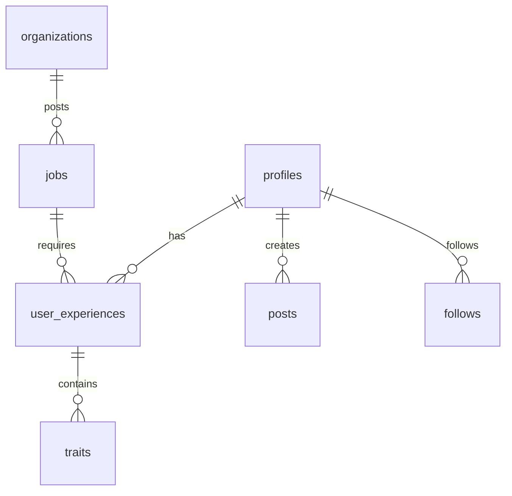
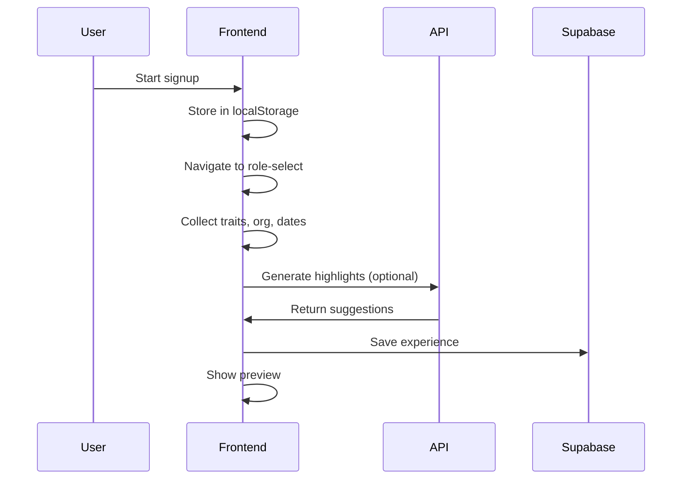
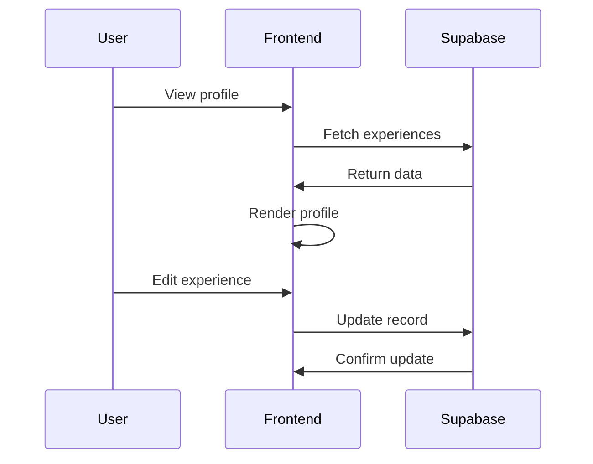
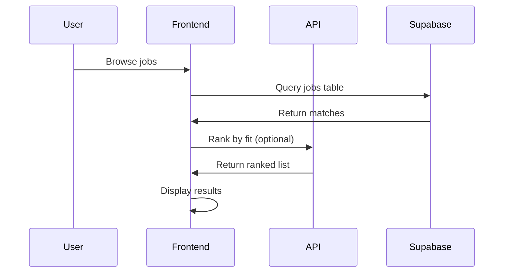
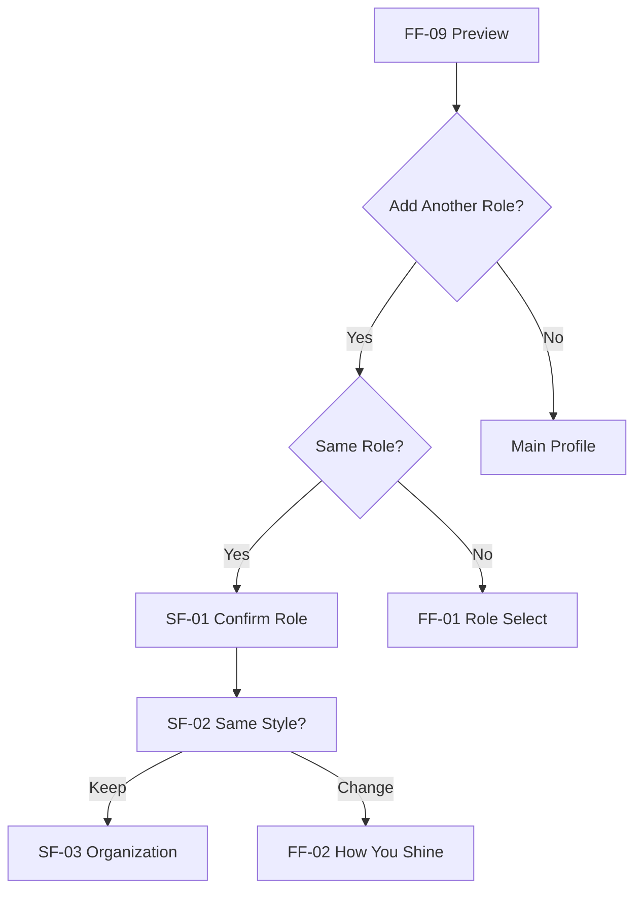

# Architecture Overview

**At a glance**: Layered architecture with clear separation between contracts, configuration, content, and UI.

## ��️ App Layers

```
┌─────────────────────────────────────┐
│              UI Layer               │
│  src/app/ + src/components/        │
├─────────────────────────────────────┤
│           Content Layer             │
│        src/content/                 │
├─────────────────────────────────────┤
│         Config Layer                │
│       src/config/                   │
├─────────────────────────────────────┤
│        Contracts Layer              │
│        src/types/                   │
├─────────────────────────────────────┤
│         Server Layer                │
│      src/app/api/ + supabase/      │
└─────────────────────────────────────┘
```

### Layer Responsibilities

- **UI**: React components, layouts, pages
- **Content**: Copy, suggestions, role-specific data
- **Config**: Flow definitions, routing logic
- **Contracts**: Type definitions, Zod schemas
- **Server**: API routes, database operations

## 📊 Data Model

### Core Tables

```sql
profiles (id, email, first_name, last_name, user_type, ...)
user_experiences (id, user_id, role, org_name, traits[], ...)
traits (id, name, category, description)
posts (id, user_id, content, type, ...)
follows (follower_id, following_id)
jobs (id, title, org_id, requirements, ...)
organizations (id, name, type, location, ...)
```

### Key Relationships



## 🔄 Request Flow Diagrams

### Onboarding Flow



### Profile Management



### Job Discovery



## 🤖 AI Integration

### Optional AI Features

- **Behind environment key**: `OPENAI_API_KEY`
- **Deterministic fallbacks**: Always functional without AI
- **Caching strategy**: Reduce API calls
- **Progressive enhancement**: AI improves, doesn't break

### AI Endpoints

```
/api/highlights          # Career suggestions
/api/highlights/bulletize # Text → bullets
/api/highlights/polish   # Content enhancement
/api/responsibilities/polish # Role descriptions
```

### Fallback Behavior

```typescript
// AI unavailable → use deterministic methods
if (!process.env.OPENAI_API_KEY) {
  return fallbackSuggestions();
}
```

## 🔒 Security & Access

- **Row Level Security (RLS)**: User data isolation
- **Environment isolation**: Separate domains per environment
- **Middleware protection**: Route-level access control
- **API rate limiting**: Prevent abuse

## 📱 Frontend Architecture

- **Next.js 14**: App Router, Server Components
- **Mobile-first**: Responsive design patterns
- **State management**: Zustand + React hooks
- **Styling**: Tailwind CSS + CSS custom properties
```

## 3. docs/WORKFLOW.md

```markdown:docs/WORKFLOW.md
# Development Workflow

**At a glance**: Daily loop with clear modes, savepoints, and guardrails.

## 🔄 Daily Loop

```
Goal → Mode (ASK/AGENT) → Savepoint → Build → CI → PR
```

### 1. **Goal Setting**
- Define what you're building today
- Check [NEXT-STEPS.md](NEXT-STEPS.md) for priorities
- Scope to one feature/component

### 2. **Mode Selection**
- **ASK Mode**: Explore, understand, plan
- **AGENT Mode**: Build, implement, test

### 3. **Savepoint Tag**
```bash
git add .
git commit -m "feat: [feature-name] - savepoint before [change]"
git tag savepoint-[feature-name]-$(date +%Y%m%d-%H%M)
git push --tags
```

### 4. **Build & Test**
```bash
npm run type:onboarding  # Type check
npm run lint             # Lint code
npm run test             # Unit tests
npm run build            # Build check
```

### 5. **CI Validation**
- Automated type checking
- Linting rules
- Unit test coverage
- 2-3 Playwright happy paths

### 6. **Pull Request**
- **App PRs**: Frontend, components, pages
- **Infra PRs**: Database, API, deployment
- **No cross-scope**: Keep changes focused

## 🚩 Feature Flags Policy

### Flag Naming
```bash
NEXT_PUBLIC_FEATURE_[FEATURE_NAME]=true
```

### Flag Usage
```typescript
if (process.env.NEXT_PUBLIC_FEATURE_AI_ASSIST === 'true') {
  // AI features enabled
} else {
  // Fallback behavior
}
```

### Flag Management
- **Development**: Enable all flags
- **Test**: Selective flag testing
- **Production**: Gradual rollout

## 🔀 App vs Infra Separation

### App Scope
- React components
- Page layouts
- User interactions
- State management

### Infra Scope
- Database schema
- API endpoints
- Authentication
- Deployment config

### Cross-Scope Rules
- **Default**: No cross-scope changes
- **Exception**: RFC required for cross-scope features
- **Review**: Tech lead approval for exceptions

## 🎯 Mode Prompts

### Explore Mode (ASK)
```
I'm exploring the codebase to understand [feature]. 
Show me the relevant files and explain how they work together.
Focus on understanding, not making changes.
```

### Build Mode (AGENT)
```
I'm building [feature] and need to modify these specific files:
- src/app/[path]/page.tsx
- src/components/[component].tsx
- src/lib/[utility].ts

Don't modify contracts/config/content unless explicitly requested.
```

## ✅ Definition of Done

### For Each Feature
- [ ] TypeScript compilation passes
- [ ] Linting rules satisfied
- [ ] Unit tests written and passing
- [ ] Feature flag implemented
- [ ] Fallback behavior tested
- [ ] Mobile responsiveness verified
- [ ] Documentation updated

### For Each PR
- [ ] Single scope (app OR infra)
- [ ] Feature flag enabled
- [ ] CI pipeline passes
- [ ] Code review completed
- [ ] Savepoint tag created

## 🚨 Guardrails

### Never
- Modify contracts without RFC
- Cross app/infra boundaries in one PR
- Deploy without feature flags
- Skip savepoint tags

### Always
- Test fallback behavior
- Verify mobile experience
- Update relevant docs
- Create savepoint before major changes

## 🔧 Quick Commands

```bash
# Create savepoint
git tag savepoint-[name]-$(date +%Y%m%d-%H%M)

# Check feature flags
grep -r "NEXT_PUBLIC_FEATURE" src/

# Run full CI locally
npm run type:onboarding && npm run lint && npm run test && npm run build

# Reset to savepoint
git reset --hard savepoint-[name]-[timestamp]
```
```

## 4. docs/ONBOARDING-V2.md

```markdown:docs/ONBOARDING-V2.md
# Onboarding V2 Specification

**At a glance**: Dual-flow system with role-specific content and optional AI enhancement.

##  Flow Overview

### Full Flow (FF-01 → FF-09)
**Use case**: First role or different role family

| Step | ID | Path | Purpose | Content Source |
|------|----|------|---------|----------------|
| 1 | FF-01 | `/role-select` | Role selection | Role options + signup data |
| 2 | FF-02 | `/how-you-shine` | Personality traits | Role-specific trait options |
| 3 | FF-03 | `/busy-shift` | Work scenarios | Role-specific scenarios |
| 4 | FF-04 | `/vibe` | Work environment | Role-specific vibe options |
| 5 | FF-05 | `/organization` | Company details | User input |
| 6 | FF-06 | `/dates` | Employment timeline | User input |
| 7 | FF-07 | `/career-highlight` | Key achievements | Role-specific suggestions |
| 8 | FF-08 | `/responsibilities` | Job duties | Role-specific options |
| 9 | FF-09 | `/preview` | Profile review | All collected data |

### Short Flow (SF-01 → SF-07)
**Use case**: Same role, different organization

| Step | ID | Path | Purpose | Content Source |
|------|----|------|---------|----------------|
| 1 | SF-01 | `/confirm-role` | Role confirmation | Previous role data |
| 2 | SF-02 | `/same-style` | Style consistency | Previous traits/vibe |
| 3 | SF-03 | `/organization` | Company details | User input |
| 4 | SF-04 | `/dates` | Employment timeline | User input |
| 5 | SF-05 | `/career-highlight` | Key achievements | Previous + new suggestions |
| 6 | SF-06 | `/responsibilities` | Job duties | Previous + new options |
| 7 | SF-07 | `/preview` | Profile review | All collected data |

## 🧭 Router & Guards

### Navigation Rules
```typescript
// Next step resolution
function getNextStep(currentStep: StepId): StepId | null {
  if (currentStep.group === 'full') {
    return NEXT_FULL[currentStep.id];
  }
  if (currentStep.group === 'short') {
    return NEXT_SHORT[currentStep.id];
  }
  return null;
}
```

### Branching Logic


### Guard Conditions
```typescript
// Example guard for dates step
const LEAVE_GUARDS = {
  "FF-06": (ctx: FlowContext) => Boolean(ctx.hasDates),
  "SF-04": (ctx: FlowContext) => Boolean(ctx.hasDates),
};
```

##  Content Principles

### Deterministic First-Paint
- **No generic defaults**: Every suggestion is role-specific
- **Content pre-loaded**: No API calls blocking initial render
- **Fallback content**: Always something to show

### Content Sources
```typescript
// Role-specific content mapping
const CONTENT_BY_ROLE = {
  bartender: {
    traits: ["creative", "detail-oriented", "customer-focused"],
    scenarios: ["calm-organized", "efficiency-mode"],
    responsibilities: ["cocktail-creation", "bar-management"]
  },
  server: {
    traits: ["people-person", "problem-solver"],
    scenarios: ["rally-team", "keep-informed"],
    responsibilities: ["guest-service", "coordination"]
  }
};
```

## 🤖 AI Integration

### Optional AI Endpoints
- **When to call**: Only for enhancement, not initial content
- **Caching strategy**: Cache AI responses to reduce API calls
- **Fallback behavior**: Deterministic content always available

### AI Usage Pattern
```typescript
// 1. Show deterministic content immediately
const suggestions = getRoleSuggestions(role);

// 2. Optionally enhance with AI (non-blocking)
if (aiEnabled && userRequestsEnhancement) {
  const enhanced = await enhanceWithAI(suggestions);
  updateContent(enhanced);
}
```

### AI Endpoints
```
POST /api/highlights/polish
- Input: Selected responsibilities
- Output: Enhanced descriptions
- Cache: 24 hours

POST /api/highlights/bulletize
- Input: User text
- Output: Resume bullets
- Cache: Not cached (user-specific)
```

## 📋 Contracts & Types

### Core Types
```typescript
interface OnboardingState {
  role: string;
  traits: TraitId[];
  scenario: ScenarioId;
  vibe: VibeId;
  organization: string;
  dates: DateRange;
  highlights: string[];
  responsibilities: ResponsibilityId[];
}

interface FlowContext {
  hasRole?: boolean;
  hasTraits?: boolean;
  hasDates?: boolean;
  isComplete?: boolean;
}
```

### Validation Schemas
```typescript
const OnboardingSchema = z.object({
  role: z.string().min(1),
  traits: z.array(z.string()).min(1).max(3),
  scenario: z.string().optional(),
  vibe: z.string().optional(),
  organization: z.string().min(1),
  dates: DateRangeSchema,
  highlights: z.array(z.string()).min(1),
  responsibilities: z.array(z.string()).min(1)
});
```

## 🎯 Implementation Status

### ✅ Complete
- [x] Flow definition (FF-01 → FF-09, SF-01 → SF-07)
- [x] Router logic (next/prev navigation)
- [x] Basic step pages (scaffold)
- [x] Content structure (role-specific)

### 🚧 In Progress
- [ ] Content population (deterministic)
- [ ] AI integration (optional enhancement)
- [ ] Validation guards
- [ ] Short flow branching

### 📋 Next Steps
- [ ] Populate role-specific content
- [ ] Implement branching logic
- [ ] Add validation guards
- [ ] Test both flows end-to-end

## 🔧 Development Commands

```bash
# Type check onboarding flow
npm run type:onboarding

# Test specific step
npm run test -- --testNamePattern="role-select"

# Build onboarding flow
npm run build
```
```

## 5. docs/ENVIRONMENTS.md

```markdown:docs/ENVIRONMENTS.md
# Environment Configuration

**At a glance**: Three-tier environment setup with domain isolation and middleware protection.

## 🌐 Environment Overview

| Environment | Domain | Purpose | Access | Status |
|-------------|--------|---------|---------|---------|
| **Development** | `localhost:3000` | Local development | Open | ✅ Active |
| **Test** | `test.servinly.com` | Feature testing | Password-gated | ✅ Active |
| **Production** | `servinly.com` | Public site | Coming Soon | 🚧 Redirected |

## 🔐 Access Control

### Development
- **No restrictions**: Full access to all features
- **Hot reload**: Instant feedback on changes
- **Debug tools**: Full console access

### Test Environment
- **Password**: `servinly.hobart-2024`
- **Access point**: `/test-gate`
- **Session**: Cookie-based (`testAccess=granted`)
- **Duration**: 24 hours

### Production
- **Status**: Coming Soon page only
- **Middleware**: Blocks all routes except `/coming-soon`
- **Purpose**: Public landing page

## 📋 Middleware Rules

### Production Rules
```typescript
// servinly.com, www.servinly.com
if (hostname === 'servinly.com' || hostname === 'www.servinly.com') {
  // Only allow coming-soon and essential assets
  if (pathname === '/coming-soon' || pathname.startsWith('/_next') || pathname.startsWith('/api')) {
    return NextResponse.next();
  }
  // Redirect ALL other paths to coming-soon
  return NextResponse.redirect(new URL('/coming-soon', request.url));
}
```

### Test Environment Rules
```typescript
// test.servinly.com
if (hostname === 'test.servinly.com') {
  // Check test access cookie
  const testAccess = request.cookies.get('testAccess')?.value;
  if (!testAccess || testAccess !== 'granted') {
    return NextResponse.redirect(new URL('/test-gate', request.url));
  }
}
```

### Development Rules
```typescript
// localhost:3000
// No restrictions, full access
```

## 📋️ Supabase Projects

### Project Structure
```
servinly-staging    # Test environment database
├── URL: https://[id].supabase.co
├── Database: PostgreSQL 15
├── Auth: Supabase Auth
└── Storage: File storage

servinly-production # Production database
├── URL: https://[id].supabase.co
├── Database: PostgreSQL 15
├── Auth: Supabase Auth
└── Storage: File storage
```

### Environment Variables
```bash
# Development
NEXT_PUBLIC_SUPABASE_URL=http://localhost:54321
NEXT_PUBLIC_SUPABASE_ANON_KEY=eyJ...

# Test
NEXT_PUBLIC_SUPABASE_URL=https://[staging-id].supabase.co
NEXT_PUBLIC_SUPABASE_ANON_KEY=eyJ...

# Production
NEXT_PUBLIC_SUPABASE_URL=https://[production-id].supabase.co
NEXT_PUBLIC_SUPABASE_ANON_KEY=eyJ...
```

### Row Level Security (RLS)
- **Enabled on all tables**: User data isolation
- **Policies**: Users can only access their own data
- **Testing**: RLS policies tested in staging

## 🚀 Vercel Deployment

### Project Mapping
```
servinly-staging    → test.servinly.com
servinly-production → servinly.com
```

### Deployment Settings
```json
{
  "framework": "nextjs",
  "buildCommand": "npm run build",
  "outputDirectory": ".next",
  "installCommand": "npm install",
  "devCommand": "npm run dev"
}
```

### Environment Variables
```bash
# Staging
NEXT_PUBLIC_SUPABASE_URL=https://[staging-id].supabase.co
NEXT_PUBLIC_SUPABASE_ANON_KEY=eyJ...
OPENAI_API_KEY=sk-...

# Production
NEXT_PUBLIC_SUPABASE_URL=https://[production-id].supabase.co
NEXT_PUBLIC_SUPABASE_ANON_KEY=eyJ...
OPENAI_API_KEY=sk-...
```

## 📋 Deployment Checklist

### Staging Deployment
- [ ] Feature flags enabled
- [ ] Environment variables set
- [ ] Database migrations applied
- [ ] Smoke tests passing
- [ ] Performance metrics acceptable

### Production Deployment
- [ ] Staging validation complete
- [ ] Feature flags configured
- [ ] Environment variables verified
- [ ] Database backup created
- [ ] Rollback plan ready

### Smoke Tests
```bash
# Test environment health
curl -f https://test.servinly.com/api/health

# Check feature flags
curl -f https://test.servinly.com/api/features

# Verify database connection
curl -f https://test.servinly.com/api/db-status
```

## 📄 Environment Sync

### Database Migrations
```bash
# Apply to staging first
supabase db push --project-ref [staging-ref]

# Test in staging
# Apply to production
supabase db push --project-ref [production-ref]
```

### Environment Variables
```bash
# Sync staging to production
vercel env pull .env.staging
vercel env push .env.production
```

### Content Updates
- **Development**: Local content changes
- **Test**: Content validation
- **Production**: Content deployment

## 🚨 Troubleshooting

### Common Issues
1. **Test access expired**: Clear cookies, re-enter password
2. **Database connection**: Check environment variables
3. **Feature flags**: Verify NEXT_PUBLIC_ variables
4. **Middleware blocking**: Check hostname configuration

### Recovery Steps
1. **Verify environment**: Check current hostname
2. **Check cookies**: Clear and re-authenticate
3. **Validate config**: Confirm environment variables
4. **Check logs**: Vercel function logs

## 🔧 Quick Commands

```bash
# Check current environment
curl -s https://[domain]/api/environment

# Test database connection
curl -s https://[domain]/api/db-status

# Verify feature flags
curl -s https://[domain]/api/features

# Clear test access
# Delete cookie: testAccess=granted
```
```

## 6. docs/RECOVERY.md

```markdown:docs/RECOVERY.md
# Recovery Kit

**At a glance**: 30-minute rollback guide for common failure scenarios.

## 🚨 Emergency Recovery

### Create Savepoint Tag
```bash
# Before making changes
git add .
git commit -m "feat: [feature-name] - emergency savepoint"
git tag emergency-[feature-name]-$(date +%Y%m%d-%H%M)
git push --tags
```

### Restore Last Good Build
```bash
# List available savepoints
git tag --list "savepoint-*" --sort=-version:refname

# Reset to specific savepoint
git reset --hard savepoint-[name]-[timestamp]

# Force push to remote (if necessary)
git push --force-with-lease origin main
```

## 🔄 Rollback Procedures

### 1. Code Rollback
```bash
# Quick rollback to last working commit
git log --oneline -10
git reset --hard [commit-hash]

# Rollback specific file
git checkout [commit-hash] -- src/app/[file].tsx

# Rollback entire feature branch
git reset --hard origin/main
```

### 2. Database Rollback
```bash
# Restore from backup
supabase db reset --project-ref [project-ref]

# Rollback specific migration
supabase migration down --project-ref [project-ref]

# Restore from dump
psql [connection-string] < backup.sql
```

### 3. Environment Rollback
```bash
# Revert environment variables
vercel env pull .env.backup
vercel env push

# Disable feature flags
vercel env rm NEXT_PUBLIC_FEATURE_[NAME]

# Rollback deployment
vercel rollback [deployment-id]
```

## 🚩 Feature Flag Recovery

### Disable Problematic Features
```bash
# Remove feature flag
vercel env rm NEXT_PUBLIC_FEATURE_AI_ASSIST

# Redeploy without feature
vercel --prod

# Verify flag is disabled
curl -s https://[domain]/api/features
```

### Re-enable Features
```bash
# Add feature flag back
vercel env add NEXT_PUBLIC_FEATURE_AI_ASSIST

# Set value
vercel env add NEXT_PUBLIC_FEATURE_AI_ASSIST true

# Redeploy
vercel --prod
```

## 🤖 AI Endpoint Recovery

### Check AI Status
```bash
# Test OpenAI connection
curl -s https://[domain]/api/highlights | jq '.hasApiKey'

# Check API key validity
curl -s https://[domain]/api/highlights | jq '.apiKeyLength'
```

### Restore AI Functionality
```bash
# Update API key
vercel env add OPENAI_API_KEY [new-key]

# Verify key works
curl -s https://[domain]/api/highlights | jq '.hasApiKey'

# Test AI endpoint
curl -X POST https://[domain]/api/highlights/bulletize \
  -H "Content-Type: application/json" \
  -d '{"text":"test","role":"bartender"}'
```

### Fallback Verification
```bash
# Test without AI key
vercel env rm OPENAI_API_KEY
vercel --prod

# Verify fallback works
curl -s https://[domain]/api/highlights | jq '.suggestions'
```

## 📞 Who to Ping

### Escalation Path
1. **Developer**: Self (immediate action)
2. **Tech Lead**: @tech-lead (30 minutes)
3. **DevOps**: @devops (1 hour)
4. **Product**: @product (2 hours)

### Contact Information
- **Tech Lead**: [tech-lead@servinly.com]
- **DevOps**: [devops@servinly.com]
- **Emergency**: [emergency@servinly.com]

## 🚨 Common Failure Modes

### 1. Build Failures
```bash
# Symptoms
npm run build fails
TypeScript errors
Linting failures

# Recovery
git reset --hard savepoint-[name]-[timestamp]
npm install
npm run build
```

### 2. Runtime Errors
```bash
# Symptoms
500 errors in production
Database connection failures
API timeouts

# Recovery
check environment variables
verify database status
rollback to last working deployment
```

### 3. Feature Flag Issues
```bash
# Symptoms
Features not working
Inconsistent behavior
Environment variable conflicts

# Recovery
disable problematic flags
redeploy without flags
verify flag configuration
```

### 4. AI Service Failures
```bash
# Symptoms
AI endpoints returning errors
OpenAI API failures
Fallback not working

# Recovery
check API key validity
verify fallback logic
disable AI features temporarily
```

## 🔧 Recovery Tools

### Health Check Scripts
```bash
#!/bin/bash
# health-check.sh
DOMAIN=$1
echo "Checking $DOMAIN..."

# Basic health
curl -f "$DOMAIN/api/health" || echo "Health check failed"

# Database status
curl -f "$DOMAIN/api/db-status" || echo "Database check failed"

# Feature flags
curl -f "$DOMAIN/api/features" || echo "Features check failed"
```

### Rollback Scripts
```bash
#!/bin/bash
# rollback.sh
SAVEPOINT=$1
echo "Rolling back to $SAVEPOINT..."

git reset --hard $SAVEPOINT
git push --force-with-lease origin main
vercel --prod

echo "Rollback complete"
```

## ✅ Recovery Checklist

### Before Changes
- [ ] Create savepoint tag
- [ ] Verify rollback path
- [ ] Test in staging first
- [ ] Have backup plan

### During Recovery
- [ ] Assess impact scope
- [ ] Choose recovery method
- [ ] Execute rollback
- [ ] Verify recovery success

### After Recovery
- [ ] Document incident
- [ ] Update procedures
- [ ] Create new savepoint
- [ ] Plan prevention measures

## 🚀 Quick Recovery Commands

```bash
# Emergency savepoint
git tag emergency-[name]-$(date +%Y%m%d-%H%M)

# Quick rollback
git reset --hard savepoint-[name]-[timestamp]

# Disable feature
vercel env rm NEXT_PUBLIC_FEATURE_[NAME]

# Redeploy
vercel --prod

# Verify recovery
curl -f https://[domain]/api/health
```
```

## 7. docs/CURSOR-PROMPTS.md

```markdown:docs/CURSOR-PROMPTS.md
# Cursor Prompts

**At a glance**: Copy-ready prompts for ASK/AGENT modes with clear scope boundaries.

## 🎯 Mode Selection

### ASK Mode (Explore)
Use when you need to understand the codebase, explore options, or plan implementation.

### AGENT Mode (Build)
Use when you're ready to implement, modify, or build features.

## 🛠️ ASK Mode Prompts

### General Exploration
```
I'm exploring the codebase to understand [specific feature/component].
Show me the relevant files and explain how they work together.
Focus on understanding the current implementation, not making changes.
```

### Architecture Understanding
```
I need to understand the architecture for [feature area].
Show me the contracts, config, content, and UI layers involved.
Explain the data flow and component relationships.
```

### Feature Planning
```
I'm planning to implement [feature].
Show me the existing patterns and components I should follow.
What are the key considerations and potential challenges?
```

### Debugging Help
```
I'm debugging an issue with [specific problem].
Show me the relevant code paths and help me understand what might be going wrong.
Don't make changes, just help me understand the issue.
```

## 🛠️ AGENT Mode Prompts

### Feature Implementation
```
I'm implementing [feature] and need to modify these specific files:
- src/app/[path]/page.tsx
- src/components/[component].tsx
- src/lib/[utility].ts

Follow the established patterns and don't modify contracts/config/content unless explicitly requested.
```

### Component Development
```
I'm building a new component for [purpose].
Create/modify these files following the established patterns:
- src/components/[component].tsx
- src/components/[component].test.tsx (if needed)

Use the existing design system and component patterns.
```

### Bug Fixes
```
I'm fixing a bug in [specific area].
Modify only the necessary files to resolve the issue:
- [list specific files]

Keep changes minimal and focused on the bug fix.
```

### Refactoring
```
I'm refactoring [component/feature] to improve [specific aspect].
Modify these files to implement the improvements:
- [list specific files]

Maintain the same functionality while improving the code structure.
```

## 📄 Scope Boundaries

### App Scope (Safe to Modify)
- React components (`src/components/`)
- Page layouts (`src/app/`)
- Hooks and utilities (`src/lib/`)
- Styles and themes (`src/styles/`)

### Infra Scope (Requires Review)
- Database schema (`supabase/`)
- API endpoints (`src/app/api/`)
- Authentication logic
- Deployment config

### Protected Scope (RFC Required)
- Contracts (`src/types/`)
- Configuration (`src/config/`)
- Content data (`src/content/`)
- Core routing logic

## 📄 Prompt Templates

### For New Features
```
I'm building [feature name] as part of [slice number] from NEXT-STEPS.md.

Scope: [app/infra]
Files to modify: [list specific files]
Feature flag: NEXT_PUBLIC_FEATURE_[NAME]

Requirements:
- [requirement 1]
- [requirement 2]
- [requirement 3]

Don't modify contracts/config/content unless explicitly requested.
```

### For Bug Fixes
```
I'm fixing a bug where [describe the issue].

Affected files: [list specific files]
Root cause: [if known]
Solution approach: [brief description]

Keep changes minimal and focused on the bug fix.
```

### For Refactoring
```
I'm refactoring [component/feature] to improve [specific aspect].

Current implementation: [brief description]
Desired improvement: [specific goal]
Files to modify: [list specific files]

Maintain existing functionality while improving [aspect].
```

## 🔒 Security & Best Practices

### Always Include
- Clear scope boundaries
- Specific file lists
- Feature flag requirements
- Don't modify instructions

### Never Include
- Vague file references
- Cross-scope changes
- Contract modifications without RFC
- Unclear requirements

## 📚 Example Prompts

### ASK Mode Example
```
I'm exploring the onboarding flow to understand how role selection works.
Show me the relevant files and explain the flow from role selection to the next step.
Focus on understanding the current implementation, not making changes.
```

### AGENT Mode Example
```
I'm implementing the AI assist feature for career highlights as part of slice 5 from NEXT-STEPS.md.

Scope: app
Files to modify:
- src/components/onboarding/CareerHighlightInput.tsx
- src/lib/useBulletize.ts
- src/app/api/highlights/bulletize/route.ts

Feature flag: NEXT_PUBLIC_FEATURE_AI_ASSIST

Requirements:
- Add AI assist button to career highlight input
- Integrate with bulletize API
- Show loading states and error handling
- Maintain fallback behavior when AI is unavailable

Don't modify contracts/config/content unless ex
