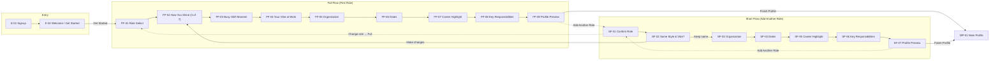

```mermaid
flowchart LR
  subgraph Entry
    E01["E-01 Signup"]
    E02["E-02 Welcome / Get Started"]
    E01 --> E02
  end

  subgraph "Full Flow (First Role)"
    FF01["FF-01 Role Select"]
    FF02["FF-02 How You Shine (3 of 7)"]
    FF03["FF-03 Busy Shift Moment"]
    FF04["FF-04 Your Vibe at Work"]
    FF05["FF-05 Organization"]
    FF06["FF-06 Dates"]
    FF07["FF-07 Career Highlight"]
    FF08["FF-08 Key Responsibilities"]
    FF09["FF-09 Profile Preview"]
    FF01 --> FF02 --> FF03 --> FF04 --> FF05 --> FF06 --> FF07 --> FF08 --> FF09
  end

  subgraph "Short Flow (Add Another Role)"
    SF01["SF-01 Confirm Role"]
    SF02["SF-02 Same Style & Vibe?"]
    SF03["SF-03 Organization"]
    SF04["SF-04 Dates"]
    SF05["SF-05 Career Highlight"]
    SF06["SF-06 Key Responsibilities"]
    SF07["SF-07 Profile Preview"]
    SF01 --> SF02
    SF02 -->|Keep same| SF03
    SF02 -->|Make changes| FF02
    SF03 --> SF04 --> SF05 --> SF06 --> SF07
  end

  MP01["MP-01 Main Profile"]

  E02 -- Get Started --> FF01
  FF09 -- Finish Profile --> MP01
  FF09 -. Add Another Role .-> SF01
  SF07 -- Finish Profile --> MP01
  SF07 -. Add Another Role .-> SF01
  SF01 -. Change role → Full .-> FF01
```